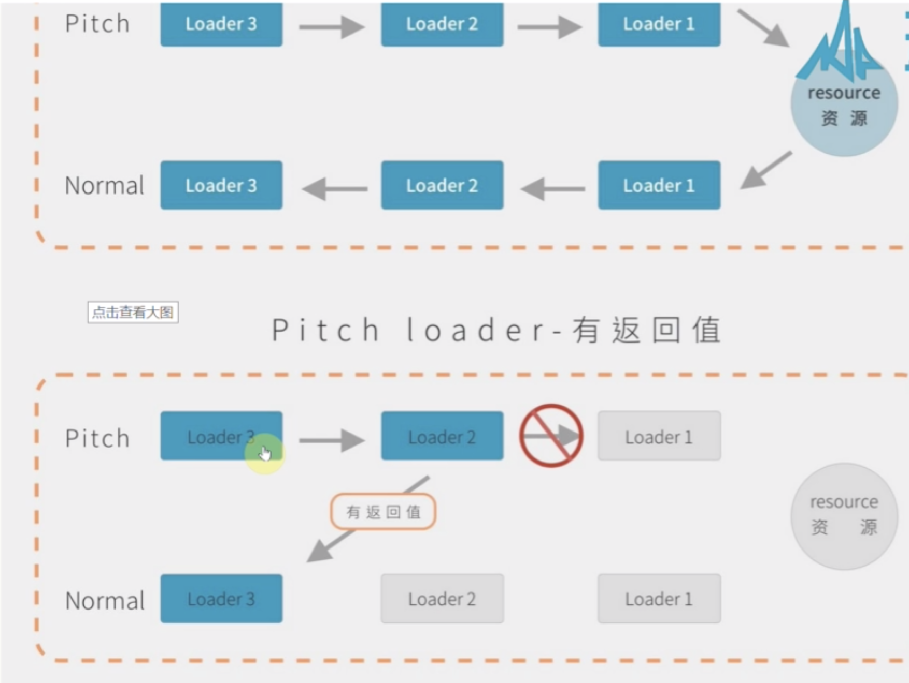

loader 执行顺序: 下到上，右到左
改变顺序： pre ,normal,inline ,post

```
  {
    test: /\.js$/,
    use: { loader: "loader2" },
    enforce: "pre" // 第一个执行 ，然后是normal，post
  }

  //inline-loader 是引用一个文件时候使用的，具体看 ./src/index.js对a.js的引用

  // 行内loader基本使用  执行顺序 loader1  inline-loader  loader2
  //require("inline-loader!./a.js");

  // 不在通过pre+normal处理  执行顺序inline-loader  loader2
  // require("-!inline-loader!./a.js");

  // 不在通过 normal 处理  执行顺序inline-loader  loader2
  //require("!inline-loader!./a.js");

  // 不需要 pre normal post 处理，只有inline-loader
  // require("!!inline-loader!./a.js");
```

loader 还有一个 pitch 方法属性，如果有返回值的话会阻断后面 loader 的运行,
pitch 执行顺序和 loader 相反的

```
function loader(source) {
  console.log("inline-loader");
  return source;
}
loader.pitch = ()=>{
  return 'test pitch';
}
module.exports = inlineLoader;

```


